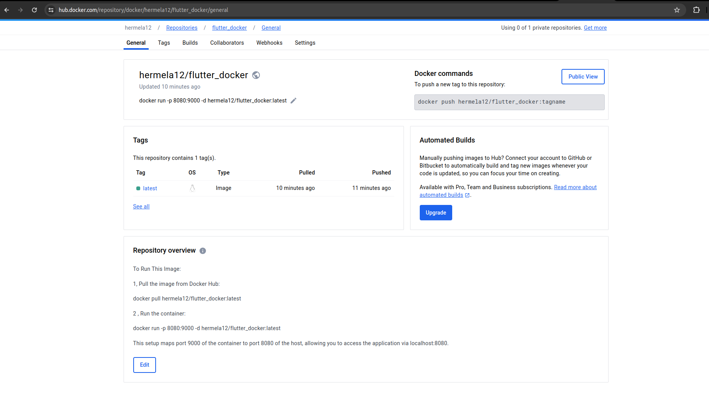

# taskmanager

A new Flutter project.

## Getting Started
For testing, simply follow the steps listed in the Repository overview on Docker Hub.
[Docker Hub Repository: hermela12/flutter_docker](https://hub.docker.com/repository/docker/hermela12/flutter_docker/general)

